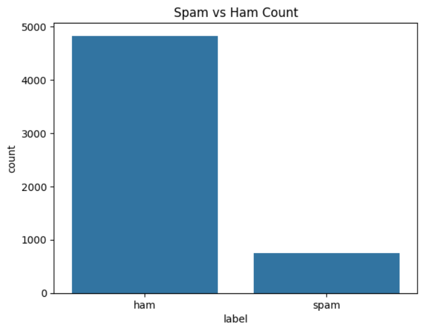
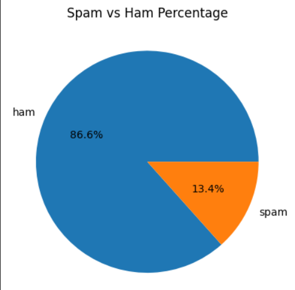

# 📧 Spam Email Detection using Data Visualization

## 📌 Introduction
Spam emails are a major issue in digital communication. This project focuses on analyzing and visualizing spam and non-spam emails to understand patterns and differences.

## 🎯 Aim
To explore spam email data and identify meaningful insights using data visualization techniques.

## ❗ Problem Statement
It is difficult to manually identify spam emails due to large volumes of data. This project aims to simplify the understanding of spam patterns using visual methods.

## 🛠️ Tools & Technologies
- Python
- Pandas
- Matplotlib
- Seaborn
- WordCloud

## 📊 Project Workflow
1. Data Collection
2. Data Cleaning
3. Data Analysis
4. Data Visualization

## 📈 Visualizations
- Spam vs Non-Spam Graph
- Pie Chart
- Word Cloud

## 📷 Project Output

### 📊 Spam vs Ham

### 🥧 Pie Chart

## 🚀 Conclusion
This project demonstrates how visualization helps in identifying spam patterns effectively.

## 👩‍💻 Author
Akshitha

